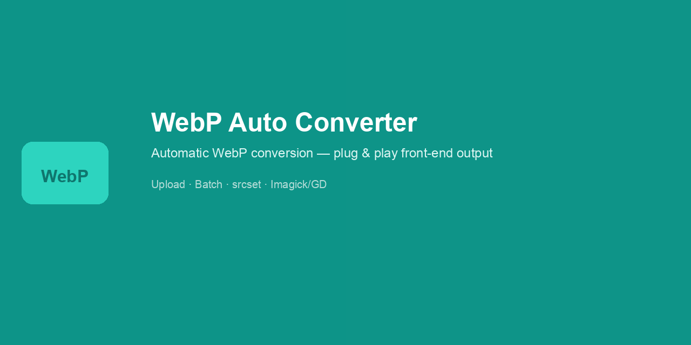
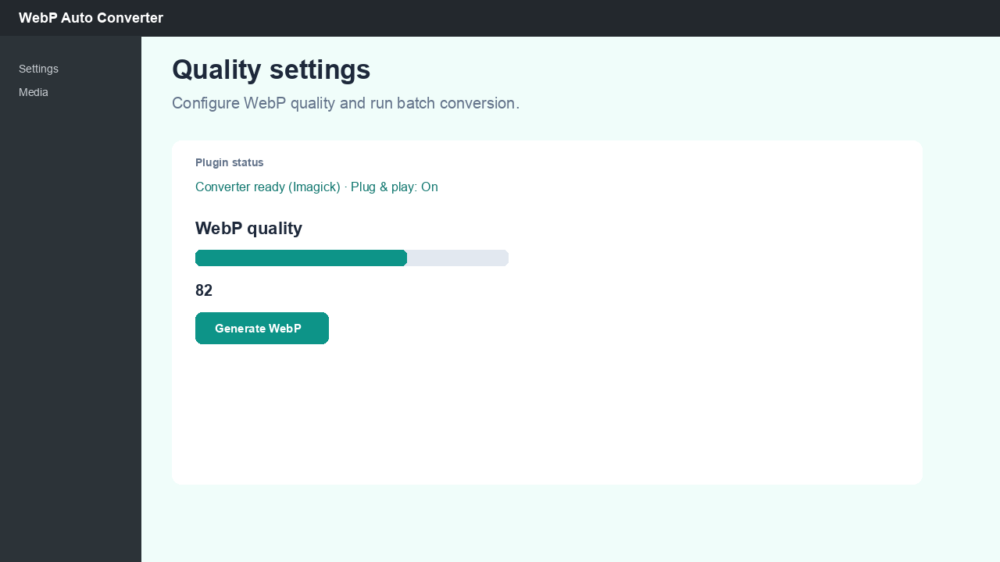
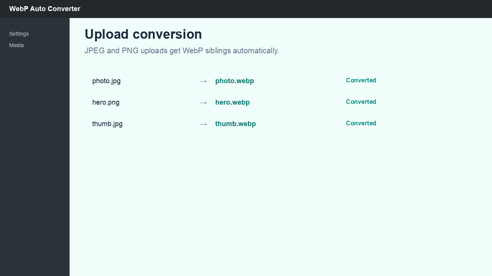
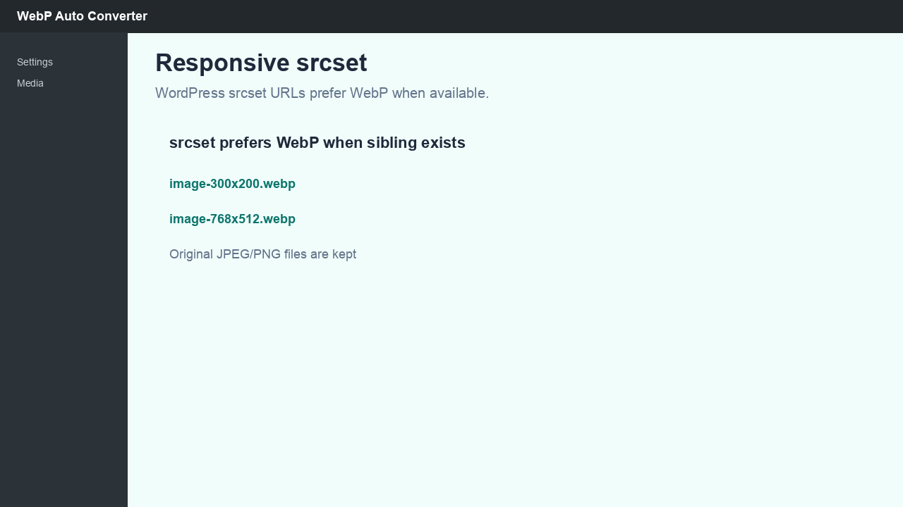

# WebP Auto Converter

<p align="center">
  
</p>

<p align="center">
  <strong>Plug & play WebP for WordPress</strong><br>
  Convert uploads · auto front-end output · batch tool · srcset preference
</p>

<p align="center">
  <a href="https://github.com/EvgeniSasim/webp-auto-converter/actions/workflows/ci.yml"></a>
  <a href="LICENSE"></a>
  <a href="webp-auto-converter/readme.txt"></a>
  <a href="webp-auto-converter/webp-auto-converter.php"></a>
</p>

<p align="center">
  
</p>

Open-source WordPress plugin that creates WebP copies of JPEG/PNG uploads and **serves them automatically** on the front end — no theme changes required.

| | |
|---|---|
| **Plugin folder** | `webp-auto-converter/` |
| **Theme helpers** | [docs/theme-helpers.md](docs/theme-helpers.md) |
| **WordPress.org** | [Submission guide](docs/wordpress-org-submission.md) |
| **Changelog** | [CHANGELOG.md](CHANGELOG.md) |

## Features

- **Plug & play** — featured images, attachment images, post/widget content (toggle in settings)
- WebP on upload (full size + registered sizes)
- Quality slider (0–100) and batch conversion for existing media
- `srcset` prefers WebP when a sibling file exists
- Imagick with GD fallback; WebP siblings removed on attachment delete
- Optional `webp_ac_*` theme helpers for custom templates

## Quick start

1. Install and activate the plugin.
2. Open **Settings → WebP Converter** — plug & play is **on** by default.
3. Upload a JPEG/PNG or click **Generate WebP** for existing media.
4. View the front end — `<picture>` markup appears when WebP siblings exist.

## Installation

### Manual

```bash
ln -s "$(pwd)/webp-auto-converter" /path/to/wordpress/wp-content/plugins/webp-auto-converter
```

Activate in wp-admin. No theme code required.

### Requirements

- WordPress 5.8+, PHP 7.4+
- GD with `imagewebp` or Imagick with WebP support

## Screenshots

| Settings | Upload conversion | srcset |
|----------|-------------------|--------|
|  |  |  |

## FAQ

**Does it delete originals?** No — `.webp` files are added alongside JPEG/PNG.

**External services?** No — all processing is local (GD/Imagick).

**Uninstall?** Options are removed; `.webp` files stay on disk (documented in readme.txt).

## Development

```bash
bash scripts/build-release.sh
python3 scripts/generate-wporg-assets.py   # requires Pillow
```

## Author

**Evgenii Sasim** — [GitHub](https://github.com/EvgeniSasim) · [WordPress.org](https://profiles.wordpress.org/evgenij347/)

## License

GPL-2.0-or-later — see [LICENSE](LICENSE).
